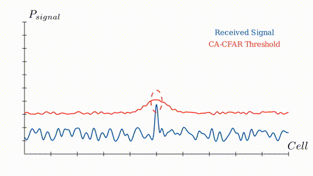

# CFAR++: Region-Aware Noise Thresholding for Safe Radar Detections

This repository complements the above-mentioned paper which has been submitted to 2025 IEEE/RSJ International Conference on Intelligent Robots and Systems.
It gives closer insights on the authors' methodology and enables to reproduce the results of the experiments.
Besides, it shall encourage to conduct own research and to improve the framework further.



## Features:

* Priori methodology with adaptable horizon for previous investigated radar signal spectra
* Criticality evaluation approach
* Plotting of diverse 

## Prerequisites

* Download the [ROD2021 dataset](https://www.cruwdataset.org/download).
* Install the package, e.g., in a virtual environment:

```console
python3 -m venv venv
source venv/bin/activate
python3
pip install -e .
```

* Setup all user-specific paths by editing `cfg/config.yaml`. 

## How to use it


* Jupyter notebooks are created for all experiments and guide you on what you can adjust.
* To find the guard bound and training bound parameters for the optimal CA-CFAR which serves as the baseline, simply run `exp_00.ipynb`.
* For the Priori Region Identification, here is a list of how each experiment of table III in the paper can be run:

| Notebook File Name         | Variant (Table III) | No. visited spectra n_{hist} | Gaussian Dimples |
| -------------------------- |:-------------------:| ----------------------------:| ----------------:|
| `exp_01.ipynb`              | A                  | 5                            |
| `exp_02.ipynb`              | B                  | 0                            |
| `exp_03.ipynb`              | C                  | 5                            | X
| `exp_03.ipynb`              | D                  | 8                            | X
| `exp_03.ipynb`              | E                  | 3                            | X

* The Camera-Aided Threshold Reduction can be run via the Notebook `exp_04.ipynb`.
* All detection metrics can be determined and displayed with the notebook `exp_metrics.ipynb`.
* Visualizations can be created with the notebook `visualizations.ipynb`.

## Acknowledgements

Credits to Yizhou Wang and his research group for providing access to the dataset ROD2021 and their cruw-devkit.


